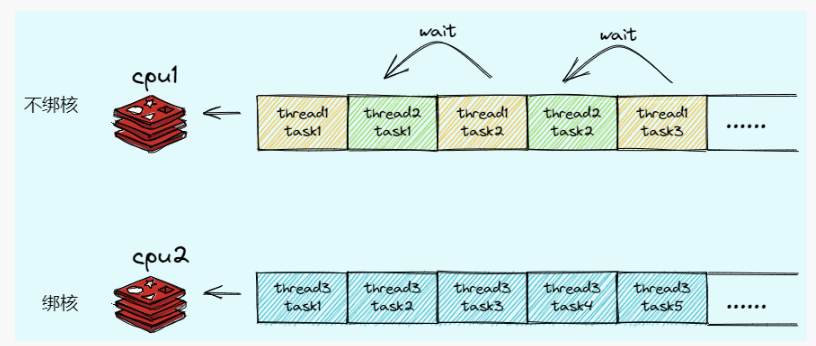

# <font  color='3d8c95'>Cpu Affinity与绑核</font>
低延迟关键不在于低，而在于稳定，稳定即可预期，可掌控。谈及Linux低延迟技术时，人们经常提到“Kernel Bypass”（内核旁路），即绕过内核，这是因为<font  color='fed3a8'>内核处理不仅慢且延迟不稳定</font>。因此一个延迟要求很高的实时任务是不能触碰内核的，“避免触碰”是一个比Bypass更高的要求：不能以任何方式进入内核。中断（Interrupt）是进入内核的方式之一，本文的关键点也在于避免关键线程被中断。即使中断发生时线程是空闲的，但重新回到用户态后CPU缓存被污染了，下一次处理请求的延迟也会变得不稳定。


## <font  color='dc843f'>Why 为什么用绑核</font>
1. 减少上下文切换：频繁的上下文切换可能导致性能下降。
2. 提高缓存局部性：处理器缓存（如L1、L2和L3缓存）存储了近期访问的数据和指令。绑核可以减少缓存未命中的次数和内存访问的延迟。
3. 避免资源争用：在某些情况下，不同的进程或线程可能会竞争相同的系统资源（如内存带宽、1/O设备或其他硬件资源）。通过绑核，可以将这些党争关系限制在特定的核心或核心组上，从而降低资源争用的影响。
4. NUMA优化：在具有非一致性内存访问（NUMA）架构的系统中，处理器访问本地节点的内存比访问远程节点的内存要快。通过将进程或线程绑定到特定的NUMA节点上的核心，可以确保它们尽可能地使用本地内存，从而提高内存访问性能。
从流程上看，我们除了将某个线程绑定到某个核心之后，我们还会限制其他线程被调度到这个核心，也就是“专核专用，这样除了具有上述优势以外，还可以让该线程独占cpu时间，从而使得该线程能够高效运行

## <font  color='dc843f'>How 如何绑核</font>
| 隔离级别          | 粒度     | 目的                                                 | 做法                                                                     |
| ----------------- | -------- | ---------------------------------------------------- | ------------------------------------------------------------------------ |
| CPU ISOLATION     | 操作系统 | 将cpu对操作系统隔离，隔离后操作系统对被隔离cpu不可见 | grubby                                                                   |
| SCHEDULE AFFINITY | 进程     | 执行进程时将进程绑定在某些cpu核上                    | taskset -c                                                               |
| THREAD AFFINITY   | 线程     | 指定线程运行在某些cpu核上                            | pthread_setaffinity_np, pthread_getaffinity_np -设置/获取线程的CPU亲和力 |

***查看进程分配的CPU Core***  
可以使用taskset命令查看：
```
taskset -c -p <pid>
pid 17147's current affinity list: 3-5
```
该CPU亲和力列表表明该进程可能会被安排在3-5中任意一个CPU Core上。

更具体地查看某进程当前正运行在哪个CPU Core上，我们可以使用top命令查看：`top -p <uid>`


***taskset***  
使用taskset命令将进程绑定到指定核：
```
taskset -cp <core> <pid>
```
如：
`taskset -cp 1,2,3 31693`该例会将PID为31693的进程绑定到1-3核上运行。

***sched_setaffinity***
编写代码时，我们可以通过sched_setaffinity()函数设置CPU亲和力的掩码，从而将该线程或者进程与指定的CPU绑定。  
一个CPU的亲和力掩码用一个cpu_set_t结构体来表示一个CPU集合，下面这几个宏分别对掩码集进行操作：
```
CPU_ZERO(cpu_set_t* cpusetp);               // 清空一个集合
CPU_SET(size_t cpu, cpu_set_t* cpusetp);    // 加入CPU Core到集合
CPU_CLR(size_t cpu, cpu_set_t* cpusetp);    // 从集合中删除指定的CPU Core
CPU_ISSET(size_t cpu, cpu_set_t* cpusetp);  // 检查一个CPU Core是否在集合中
```
使用sched_setaffinity()与sched_getaffinity()等函数需要引进头文件sched.h。

头文件：sched.h
>int sched_setaffinity(pid_t pid, size_t cpusetsize, const cpu_set_t* mask)  
该函数将PID为pid的进程设置为运行在mask指定的CPU Core上。  
若pid为0，则表示指定当前进程。  
cpusetsize为mask的大小，通常为sizeof(cpu_set_t)。  
cpuset即用cpu_set_t结构体表示的CPU Core集合。  
函数返回0表示成功，失败则返回-1。

>int sched_getaffinity(pid_t pid, size_t cpusetsize, cpu_set_t* mask)  
函数获取PID为pid的进程CPU亲和力掩码，并保存在mask结构体中，即获得指定pid当前可以运行在哪些CPU上。  
若pid为0，则表示指定当前进程。  
cpusetsize为mask的大小，通常为sizeof(cpu_set_t)。  
cpuset即用cpu_set_t结构体表示的CPU Core集合。  
函数返回0表示成功，失败则返回-1。
  
使用示例：
[set_affinity.hpp](../test_utility/set_affinity.hpp)  
注意：若使用到pthread，则需要将pthread.h放到sched.h之后，并在sched.h之前声明#define __USE_GNU，否则会出现undefined reference CPU_ZERO等错误。

***屏蔽硬中断（硬盘、网卡）***  
中断源（IRQ）向CPU Core发送中断，CPU Core调用中断处理程序对中断进程处理。我们可以通过改写/proc/irq/*/smp_affinity文件，避免中断源（IRQ）向某些CPU Core发送中断。该方法对硬盘、网卡等设备引起的硬中断有效。
查看设备中断数据
通过查看/proc/interrupts文件可查看设备中断数据：
```
           CPU0       CPU1       CPU2       CPU3       CPU4       CPU5       CPU6       CPU7       
  0:         17          0          0          0          0          0          0          0   IO-APIC   2-edge      timer
  8:          0          0          0          0          0          1          0          0   IO-APIC   8-edge      rtc0
  9:       4058        258        157         14        464        454         34        134   IO-APIC   9-fasteoi   acpi
 16:     137153      19574      11430      10138      47072      27502      15934      10113   IO-APIC  16-fasteoi   ahci[0000:05:00.0], xhci-hcd:usb1, nvkm
 17:         16          3          1          9         35          2          2          1   IO-APIC  17-fasteoi   snd_hda_intel:card1
 18:      88952       2170       1592       1253       4255       5430       1790       1738   IO-APIC  18-fasteoi   wlp3s0
 22:     172111       2954       2515       1897       5000       3684       2479       2513   IO-APIC  22-fasteoi   snd_hda_intel:card0
NMI:          0          0          0          0          0          0          0          0   Non-maskable interrupts
LOC:     395090     279787     239243     235695     233918      90471      94234      90479   Local timer interrupts
SPU:          0          0          0          0          0          0          0          0   Spurious interrupts
PMI:          0          0          0          0          0          0          0          0   Performance monitoring interrupts
IWI:          0          0          0          1          1          1          0          3   IRQ work interrupts
RTR:          6          0          0          0          0          0          0          0   APIC ICR read retries
RES:       7425       5663       4375       3801       3051       2825       1963       1787   Rescheduling interrupts
CAL:         31         29         24         22         36         28         34         31   Function call interrupts
TLB:      10387      11374      10758      11769       7566       8508       8799       7195   TLB shootdowns
TRM:          2          2          2          2          2          2          2          2   Thermal event interrupts
THR:          0          0          0          0          0          0          0          0   Threshold APIC interrupts
MCE:          0          0          0          0          0          0          0          0   Machine check exceptions
MCP:         17         17         17         17         17         17         17         17   Machine check polls
ERR:          0
MIS:          0
PIN:          0          0          0          0          0          0          0          0   Posted-interrupt notification event
PIW:          0          0          0          0          0          0          0          0   Posted-interrupt wakeup event
```
- 第一列是IRQ号
- 第二列开始表示某CPU内核被多少次中断。

***SMP_AFFINITY***  
SMP，即symmetric multiprocessing（对称多处理器），通过多个处理器处理程序的方式。smp_affinity文件处理一个IRQ的中断亲和性。在smp_affinity文件结合每个IRQ号在/proc/irq/{IRQ_NUMBER}/smp_affinity文件。该文件的值是一个16进制掩码表示系统的所有CPU核。
例如，Solarflare网卡的设备名为eth1，其中断如下：
grep eth1 /proc/interrupts
输出如下：
```
64:    95218  168786727  0  0  0  0  0  0  0  0  0  0  0  0  0  0  0  0  IR-PCI-MSI-edge  eth1-0
65:    38440  53649095   0  0  0  0  0  0  0  0  0  0  0  0  0  0  0  0  IR-PCI-MSI-edge  eth1-1
66:    6207   1011519    0  0  0  0  0  0  0  0  0  0  0  0  0  0  0  0  IR-PCI-MSI-edge  eth1-ptp
```
可以看到eth1设备共有三个IRQ号：64,65,66，其相对应的smp_afffinity文件时：
```
cat /proc/irq/64/smp_affinity
cat /proc/irq/65/smp_affinity
cat /proc/irq/66/smp_affinity
```
输出：
```
0000,00000000,00000000,0000000f
0000,00000000,00000000,0000000f
0000,00000000,00000000,0000000f
```
smp_affinity是16进制表示，f就是二进制的1111，表示0-3这四个CPU Core都会参与处理中断。
假设我们想要指定仅0-1这两个核心处理中断，则可以写入如下数据到smp_affinity：
```
echo 3 > /proc/irq/64/smp_affinity
echo 3 > /proc/irq/65/smp_affinity
echo 3 > /proc/irq/66/smp_affinity
```

***屏蔽软中断（Work queue）***  
workqueue是自kernel2.6引入的一种任务执行机制，和softirq，tasklet并称下半部（bottom half）三剑客。workqueue在进程上下文异步执行任务，能够进行睡眠。可以通过改写/sys/devices/virtual/workqueue/*/cpumask文件实现屏蔽Work queue的软中断。
/sys/devices/virtual/workqueue/cpumask文件中记录了全局的cpumask，可以影响所有的workqueue。文件内容格式与smp_affinity相同：
```
cat /sys/devices/virtual/workqueue/cpumask
```
输出如下：
```
0000,00000000,00000000,00000007
```
代表0-2这三个CPU Core用来处理work queue，我们可以通过写入"f"来仅让与核心进程无关的0-3这四个CPU Core参与work queue处理：
```
echo 'f' > /sys/devices/virtual/workqueue/cpumask
```

***屏蔽软中断（Local Timer Interrupt）***  
Linux的scheduler time slice是通过LOC实现的，如果我们让一个线程独占一个CPU Core，就不需要scheduler在这个CPU Core上切换进程。可以通过isolcpus系统启动选项隔离一些核，让他们只能被绑定的线程使用。同时，我们还可以启用“adaptive-ticks”模式，达到减少独占线程收到LOC频率的效果，这可以通过nohz_full和rcu_nocbs启动选项实现。  
假设令6-8三个核心屏蔽软中断，我们需要在系统启动选项中加入：
```
nohz=on nohz_full=6-8 rcu_nocbs=6-8
```
进入adaptive-ticks模式后，如果CPU Core上的running task只有一个时，系统向其发送的LOC频率会显著降低，但LOC不能被完全屏蔽，系统内核的一些操作比如计算CPU负载等仍然需要周期性的LOC。
