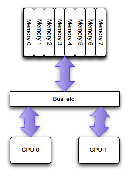
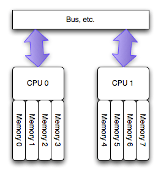
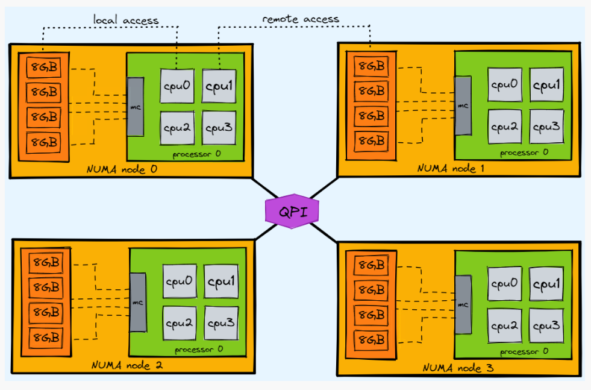

# <font  color='3d8c95'>Memory Affinity与NUMA</font>
NUMA （Non-uniform memory access，非一致性内存访问）架构是近代计算机常见的一种架构。随着 CPU 近年来性能提升速度的逐渐放缓，开始出现通过多个 CPU 共同工作来提升性能的方式，而 NUMA 则是伴随这种方式出现的一种优化方案。

## <font  color='dc843f'>Why 为什么用NUMA</font>
从硬件角度来看，如果按照以前的SMP计算机架构，多个 CPU 之间访问同一块内存，会共用一个 bus：  


但是这样一来，bus 就很可能出现性能瓶颈，导致整体性能的降低，因此就出现了 NUMA 架构：  


>简略说明  
**SMP（多CPU平等共享相同的内存和 I/O 资源）**  
就是 对称多处理器 ，就是所有的cpu 必须通过相同的内存总线/数据总线访问相同的内存资源/IO资源。所以所有cpu访问内存/IO资源等的速度是一样的，即对称。  
<font  color='fed3a8'>缺点：CPU数量的增加，内存/IO资源访问冲突将迅速增加，最终会造成CPU资源的浪费，使 CPU性能的有效性大大降低。</font>  
**Non-NUMA（多CPU平等共享相同的内存资源）**  
Non-NUMA，也称为UMA（Uniform Memory Access）系统所有的CPU确实通过相同的内存总线共享相同的内存资源。所有CPU对内存的访问时间是相同的，即内存访问延迟一致，不存在本地内存和远程内存的区别，即一致性内存访问系统。    
可见Non-NUMA就是SMP的一种。  
**NUMA（多CPU分到多个Node中，每个node有自己的物理内存）**  
将CPU划分到多个Node中，每个node有自己独立的内存空间。各个node之间通过高速互联通讯  
CPU访问不同类型节点内存的速度是不相同的，访问本地节点的速度最快，访问远端节点的速度最慢，即访问速度与节点的距离有关，距离越远访问速度越慢，即非一致内存访问。  
<font  color='fed3a8'>缺点：本node的内存不足时，需要垮节点访问内存，节点接的访问速度慢。</font>  


## <font  color='dc843f'>How 如何使用NUMA</font>
`numactl --hardware`可以查看硬件对 NUMA 的支持信息
```
# numactl --hardware
available: 2 nodes (0-1)
node 0 cpus: 0 1 2 3 4 5 6 7 8 9 10 11 12 13 14 15 16 17 18 19 20 21 22 23 48 49 50 51 52 53 54 55 56 57 58 59 60 61 62 63 64 65 66 67 68 69 70 71
node 0 size: 96920 MB
node 0 free: 2951 MB
node 1 cpus: 24 25 26 27 28 29 30 31 32 33 34 35 36 37 38 39 40 41 42 43 44 45 46 47 72 73 74 75 76 77 78 79 80 81 82 83 84 85 86 87 88 89 90 91 92 93 94 95
node 1 size: 98304 MB
node 1 free: 33 MB
node distances:
node   0   1 
  0:  10  21 
  1:  21  10
```
执行`numactl --show`显示当前的 NUMA 设置：
```
# numactl --show
policy: default
preferred node: current
physcpubind: 0 1 2 3 4 5 6 7 8 9 10 11 12 13 14 15 16 17 18 19 20 21 22 23 24 25 26 27 28 29 30 31 32 33 34 35 36 37 38 39 40 41 42 43 44 45 46 47 48 49 50 51 52 53 54 55 56 57 58 59 60 61 62 63 64 65 66 67 68 69 70 71 72 73 74 75 76 77 78 79 80 81 82 83 84 85 86 87 88 89 90 91 92 93 94 95 
cpubind: 0 1 
nodebind: 0 1 
membind: 0 1 
```
numactl 命令还有几个重要选项：  
`--cpubind=0`： 绑定到 node 0 的 CPU 上执行。  
`--membind=1`： 只在 node 1 上分配内存。  
`--interleave=nodes`：nodes 可以是 all、N,N,N 或 N-N，表示在 nodes 上轮循（round robin）分配内存。  
`--physcpubind=cpus`：cpus 是 /proc/cpuinfo 中的 processor（超线程） 字段，cpus 的格式与 --interleave=nodes 一样，表示绑定到 cpus 上运行。  
`--preferred=1`： 优先考虑从 node 1 上分配内存。  
numactl 命令的几个例子：
```
# 运行 test_program 程序，参数是 argument，绑定到 node 0 的 CPU 和 node 1 的内存
numactl --cpubind=0 --membind=1 test_program arguments
 
# 在 processor 0-4，8-12 上运行 test_program
numactl --physcpubind=0-4,8-12 test_program arguments
 
# 轮询分配内存
numactl --interleave=all test_program arguments
 
# 优先考虑从 node 1 上分配内存
numactl --preferred=1
```

***建议用法***  
1. 查看numa节点拓扑情况
2. 利用isolcpus等内核启动参数将目标程序需要运行的numa node对应核心空出来，并屏蔽部分中断。  
3. 将目标程序使用numactl绑定在指定numa node上

***关闭NUMA***  
- 方法一：通过bios关闭  
BIOS:interleave = Disable / Enable
- 方法二：通过OS关闭  
1、编辑 /etc/default/grub 文件，加上：numa=off
GRUB_CMDLINE_LINUX="crashkernel=auto numa=off rd.lvm.lv=centos/root rd.lvm.lv=centos/swap rhgb quiet"  
2、重新生成 /etc/grub2.cfg 配置文件：# grub2-mkconfig -o /etc/grub2.cfg

若不关闭NUMA，要注意numa_balancing带来的TLB shutdown

## <font  color='dc843f'>测试 NUMA</font>
[test_numa](assets/test_NUMA/test_numa.cpp)
```
numactl --cpubind=0 --membind=0 ./${PROJECT_ID}.elf 20000
numactl --cpubind=0 --membind=1 ./${PROJECT_ID}.elf 20000 
```
对比输出可得使用远程内存比使用本地内存慢了约30%

#### <font color="dc843f">查看进程的 NUMA 内存分布</font>
运行命令：
numastat -p 1234
输出示例：
```
Per-node process memory usage (in MBs) for PID 1234 (mysqld)
                           Node 0          Node 1           Total
                  --------------- --------------- ---------------
Heap                  500.12          2000.45        2500.57
Stack                  10.23             5.67          15.90
Private               300.78          1500.34        1801.12
Shared                100.00            50.00         150.00
Anonymous             800.00          3500.00        4300.00
File                  200.00           100.00         300.00
Total                1910.13          7156.46        9066.59
Possible              2048.00          8192.00       10240.00
```

1. 字段解析
Heap：进程堆内存（动态分配的内存，如 Java/C++ 对象）。  
Stack：线程栈内存（每个线程独立分配）。  
Private：私有内存（仅被当前进程使用，如堆、栈）。  
Shared：共享内存（如共享库、IPC 共享内存）。  
Anonymous：匿名内存（无文件背景的内存，如动态分配的堆）。  
File：文件映射内存（如内存映射文件、共享库）。  
Total：进程在该节点占用的总内存。  
Possible：系统理论可分配给该进程的最大内存（内核估算值）。

不均衡分配：若进程的 Heap 或 Private 内存集中在某一节点（如 Node1），而进程的 CPU 绑定在另一节点（如 Node0），则会导致跨节点访问延迟。  
跨节点共享内存：如果 Shared 内存分布在多个节点，可能因同步开销导致性能下降。  
Possible 值异常：若 Possible 远小于实际分配值，说明内核认为进程无法获得足够内存，可能触发 OOM（内存不足）。  

场景 1：跨节点内存分配  
现象：进程的 Heap 或 Private 内存主要分布在非本地节点。  
Heap (Node0): 500 MB   Heap (Node1): 2000 MB  
分析：如果该进程的 CPU 绑定在 Node0，但堆内存主要在 Node1，访问延迟会显著增加。  

场景 2：内存碎片化  
现象：File 或 Shared 内存分布在多个节点，且数值较高。  
Shared (Node0): 100 MB   Shared (Node1): 50 MB  
分析：共享内存跨节点分布可能导致缓存一致性开销（如多线程频繁访问不同节点的共享数据）。  

场景 3：内存不足  
现象：Total 接近 Possible，或 Possible 显著小于预期。  
Total (Node0): 1910 MB   Possible (Node0): 2048 MB  
分析：进程可能因节点内存不足导致分配失败（需检查系统剩余内存）。 

# <font color="3d8c95">额外</font>
#### <font color="dc843f">禁用Hypter-Threading可能导致NUMA node增加</font>
实测Intel(R) Xeon(R) Gold 6346 CPU @ 3.10GHz禁用后节点从2 ==> 4