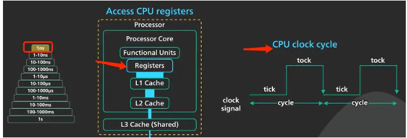
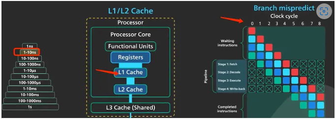
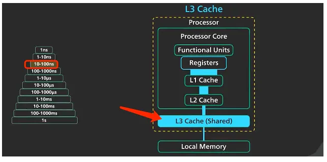
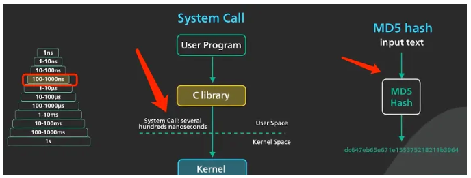
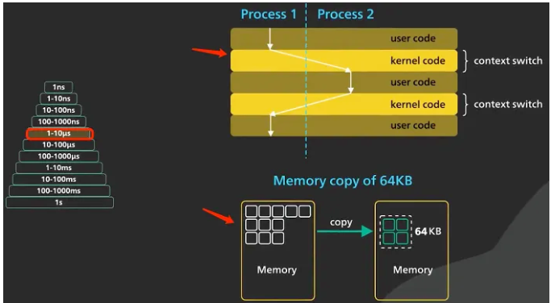
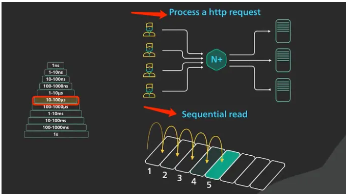
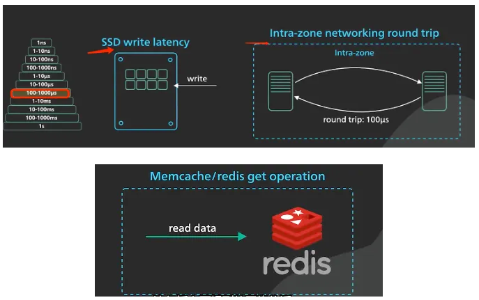
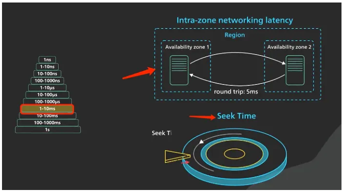
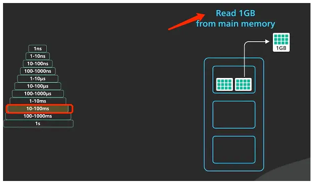
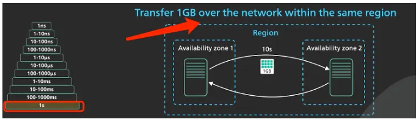

# DelayNumber延迟数字
对计算机各类操作的耗时做了大致估计。这些数字在很多地方都很有用，了解这些数字有助于我们在系统设计时比较不同的解决方案，挑选一个最优的方案。

这些数字大多是 2009 年给出的，计算机发展到今天，内存、SSD 和机械硬盘顺序读取速度有了非常大的提升，导致这些数字有些过时，下面给出2020年左右的一些数据。
需要注意的是我们重点在于关注这些延迟数据之间的数量级和比例，如寄存器/L1/L2缓存的访问时间在ns级别 左右；内存访问速度大约是 磁盘访问速度的10w倍。而不是纠结于寄存器的访问时间究竟是几ns，这也不可能有一个统一的答案，因为每台计算机的硬件不一样性能也不一样。

1ns级别：对cpu寄存器的访问在1ns这个级别。现代cpu的时钟周期也在1n秒范围内。

1-10ns级别：L1/L2缓存的访问时间以及一些复杂的cpu指令（类似分支预测错误惩罚）的执行时间都在这个级别。

10-100ns级别：L3缓存的访问时间在这个级别。

100-1000ns级别：Linux上一个简单的系统调用（只考虑系统陷入内核直接返回的时间，不考虑执行系统调用本身的时间）需要几百ns；MD5生成 64位散列值大约需要200ns。

1-10us级别：Linux内核上下文切换的时间；主内存数据复制的时间级别。

10-100us级别：Nginx大约需要50us处理一个http请求；顺序从主存读取1M数据大约是50us；

100-1000us级别：SSD写入一页大概需要1000us，区域内网络返回需要几百us；Memcache/Redis的get操作大概在几百到1000us。

1-10ms级别：现代云网络区域间的网络往返时间在这个时间范围；磁盘驱动器的寻道时间在5ms左右（硬盘）。

10-100ms级别：从主内存顺序读取1GB数据花费的时间在这个范围内。

100-1000ms级别：bcrypt加密需要的时间大约在300ms；TLS握手通常在250ms到500ms范围；从SSD连续读取1GB数据也是这个时间范围。

10s级别：相同的云区域内通过网络传输1GB数据大约需要10S。

