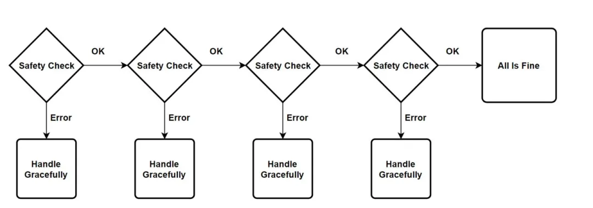
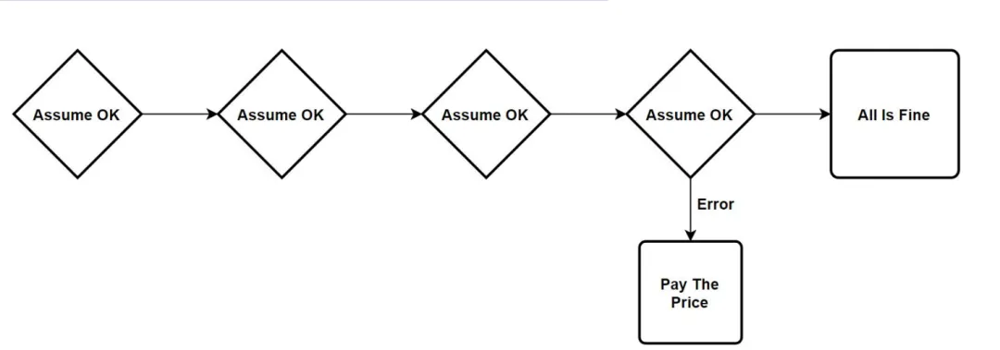

# <font  color='3d8c95'>CRTP奇异模板</font>
## <font  color='dc843f'>Why use CRTP</font>
程序每个运行时操作都会带来性能损耗。而在分支预测错误的情况下，这种损耗会进一步加剧，意味着CPU周期被浪费。所以需要设计致力于创建一个确定性的、静态的流程，通过将开销转移到编译和初始化时间，来最小化运行时的分支。通过这种办法将尽可能多的决策和开销转移到编译和初始化阶段，来减少运行时的分支数量。这样做的好处是，虽然编译和初始化时间可能会增加，但运行时的性能会更加稳定和高效。

下面是一个典型的分支流程：

进行优化思路如下：

CRTP（Curiously Recurring Template Pattern）是C++模板编程中的一种通常采用方法和设计模式，它是指一个类（通常是基类）以其派生类作为模板参数的模式。或者说，基类是一个模板类，派生类在继承该基类时，将自身作为模板参数传递给基类。通过这种模式，基类可以访问派生类的成员，从而实现代码的复用和扩展。

通过使用CRTP，可以在编译期间将基类的行为特化到派生类中，而无需运行时的虚函数调用开销，使得在编译时实现静态多态性。

## <font  color='dc843f'>How to use CRTP</font>
---
示例代码1：
```
class order {
public:
    virtual void place_order() {
        // 通用实现（例如默认订单处理逻辑）
    }
};

class specific_order : public order {
public:
    void place_order() override {
        // 特定实现（例如高频交易的特殊订单逻辑）
    }
};

class generic_order : public order {
    // 无重写，直接继承基类的place_order()
};
```
上面的代码示例有三个类：基类order，派生类specific_order和generic_order。  
基类order有一个虚函数place_order()，并提供了默认实现。specific_order重写了这个虚函数，而generic_order继承自order但没有重写place_order()。

generic_order没有实现place_order()意味着它直接使用基类的默认实现。在某些情况下可能合理，比如当存在一种通用的订单类型不需要特殊处理时。当然，这个在实际中肯定会存在一些风险，因为基类的默认实现如果遇到不适用的业务场景，那系统肯定会出现逻辑错误。

---
示例代码2：
```
#include <iostream>

template <typename actual_type>
class order {
public:
    void place_order() {
        std::cout << "基类：调用 ";
        static_cast<actual_type*>(this)->actual_place();
    }

    void actual_place() { 
        std::cout << "基类默认逻辑" << std::endl;
    }
};

class specific_order : public order<specific_order> {
public:
    void actual_place() { 
        std::cout << "specific_order 的特定逻辑" << std::endl;
    }
};

class generic_order : public order<generic_order> { 
    // 使用基类默认的 actual_place()
};

int main() {
    specific_order so;
    so.place_order();  // 输出：基类：调用 specific_order 的特定逻辑

    generic_order go;
    go.place_order();  // 输出：基类：调用 基类默认逻辑

    return 0;
}
```
这段代码就使用了***CRTP实现静态多态***，这样就可以通过编译时多态替代运行时虚函数机制，从而提升性能。详细来分析下：

首先定义了一个模版参数actual_type，表示派生类的具体类型，基类通过此参数访问派生类的成员方法。

- place_order() 方法通过 static_cast<actual_type*>(this) 将基类指针转换为派生类指针，并调用派生类的 actual_place()。（注意：这就是是CRTP的核心：基类直接调用派生类的方法，不使用虚函数表，如本代码中，基类模板通过 static_cast 将 this 指针转换为派生类类型，直接调用派生类的方法。这个过程在编译时完成，节约运行时的开销。），其中actual_place() 方法基类提供一个默认实现，但派生类可以选择覆盖它。

- 派生类 specific_order 继承自 order<specific_order>，即模板参数为自身类型。这是CRTP的标准用法。覆盖 actual_place()，提供了具体的订单处理逻辑，替换基类的默认实现。其调用流程为：当调用 specific_order::place_order() 时，会执行基类的 place_order() 方法，进而调用派生类的 actual_place()。

- 派生类 generic_order 同样继承自模板参数为自身的基类 order<generic_order>。未覆盖 actual_place()：直接使用基类中定义的默认实现。

其中order<actual_type>::actual_place() 可包含通用逻辑（如订单验证、日志记录）。

---
示例代码3：
```
template <class Execution, template <class A, class B> class SocketHandlerType = SocketHandlers::Tcp>
class BOE2 : public ExecutionProtocol<Execution, SocketHandlerType, BOE2SequenceSourceType, HeartbeatPolicy::Send>
{ 
    // 类体内容...
};
```
目的是通过模板和策略模式实现了一个高度可配置的订单执行引擎。

- Execution：（执行策略）：表示订单执行的具体逻辑（如直接执行、批量执行、智能路由等），比如时间中我们可能存在条件单，或者直接委托的订单。通过模板参数注入，就实现了不同执行策略的灵活切换。
- SocketHandlerType：接受两个类型参数（A和B），表示网络协议的具体实现。比如代码示例中默认是：TCP。

BOE2继承自ExecutionProtocol，其模板参数如下：
- Execution：传递来自BOE2的执行策略，决定订单如何发送到交易所。
- SocketHandlerType：传递网络协议处理策略，管理底层通信（如TCP/UDP）。
- BOE2SequenceSourceType：序列号生成策略，用于为每条订单生成唯一标识（如时间戳+计数器）。需在代码其他位置定义。
- HeartbeatPolicy::Send：心跳策略，定期发送心跳包以维持连接活跃。Send表示主动发送心跳，其他策略可能包括Ignore（不处理）或Respond（仅响应心跳）。


---
通过模板参数将不同策略（执行、网络、心跳）注入基类，实现模块化设计。各策略独立变化，互不影响。采用模板元编程，在编译时确定具体策略类型，避免运行时多态开销，适合高频交易的低延迟需求。也可以转换成如下代码更好的理解：
```
// 定义策略组件
struct BOE2SequenceSourceType {
    static int generate_id() { return /* 生成唯一序列号 */; }
};

// 实例化BOE2类
using TcpEngine = BOE2<DirectExecution>;                  // 默认TCP协议
using UdpEngine = BOE2<BatchExecution, SocketHandlers::Udp>; // 使用UDP协议

// 使用
TcpEngine tcp_engine;
tcp_engine.send_order(/* 订单详情 */); // 通过TCP发送，直接执行

UdpEngine udp_engine;
udp_engine.send_order(/* 订单详情 */); // 通过UDP发送，批量执行
```

---
再整体比较下上面给出的三种代码示例的优缺点，当然重点是CRTP：
| 维度       | 代码1 (传统多态)      | 代码2 (CRTP静态多态)             | 代码3 (策略组合+CRTP)              |
| ---------- | --------------------- | -------------------------------- | ---------------------------------- |
| 多态类型   | 动态多态 (运行时绑定) | 静态多态 (编译时绑定)            | 静态多态 (编译时绑定)              |
| 性能       | 有虚函数开销          | 无虚函数开销，性能更优           | 无虚函数开销，性能更优             |
| 灵活性     | 运行时动态替换派生类  | 编译时固定派生类行为             | 通过模板参数组合多种策略，灵活性高 |
| 代码复杂度 | 简单，易理解          | 中等，需理解模板和CRTP           | 高，涉及嵌套模板和策略模式         |
| 适用场景   | 需要运行时多态的场景  | 高性能场景（如高频交易核心逻辑） | 需要高度可配置性和扩展性的模块     |