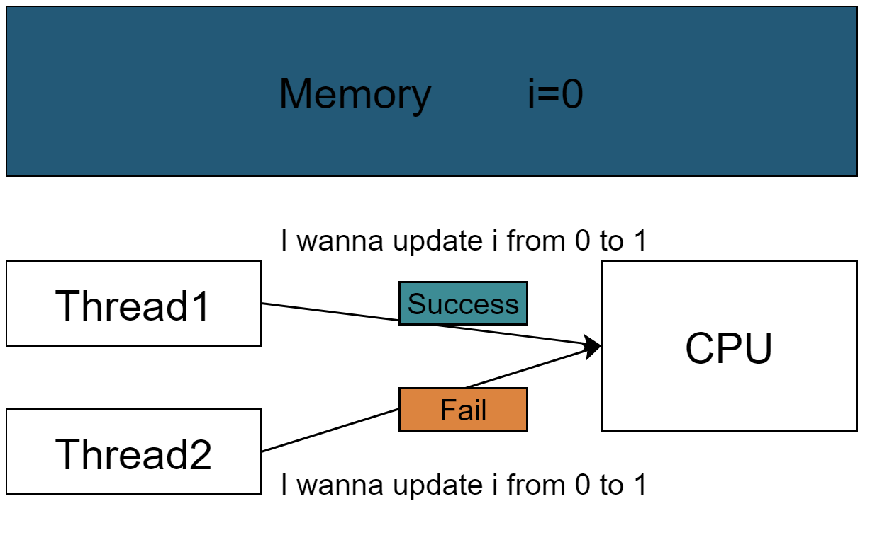

# <font color="3d8c95">atomic原子操作</font>
原子操作是比互斥锁还要low-level的同步模型，我第一次听到原子操作这个概念，是在操作系统课上，即互斥锁的加锁和解锁是原子操作。其实加锁、解锁就是在维护一个flag，该flag是原子类型，++、–要么不执行，要么一口气执行。

以最简单的i++为例，cpu在执行时不是一步到位的，而是被编译成三步：load、add、store。在单线程中不成问题，但到多线程中就会出现数据丢失的情况：

| thread A | thread B |
| -------- | -------- |
| load i   |          |
|          | load i   |
| add i    |          |
| store i  |          |
|          | add i    |
|          | store i  |

下面先来讲一下原子操作的底层实现。
## <font  color='dc843f'>原子操作在CPU中的实现</font>
首先，明白一点，<font  color='fed3a8'>*由于总线等资源的独占性，一次读或者一次写，是”天然“atomic的。*</font>
因为总线上只能传输一份数据，在电路级别上就是不可分割的。当然提前是数据小于总线宽度、且与cache行地址对齐。否则读or写一份数据要多次。
当不满足上述条件时，CPU通过锁总线和锁cache来实现其他原子操作:

***锁总线***  
锁住总线，避免在此指令执行期间其它核心/其它CPU对内存进行操作。但是这种方法缺点很明显，一棒子全打死效率较低。

***锁cache***  
除了I/O，大部分的内存可以被cache命中，那么我们只要以cache行为单位进行互斥访问（相当于给cache上锁），不就行了。
所以比较近代的CPU利用缓存一致性协议，对此进行了改进，只是将相应的cache行声明为独占进行锁定。

思考一个问题：如果操作的数据跨越了2个cache块，此时锁cache还能用吗？不行了，这时老老实实采用锁总线。

更详细介绍，请参考[ Linux中的原子操作](https://zhuanlan.zhihu.com/p/89299392)。
其实原子操作的概念是广义的，在单核cpu中，关中断也可以看成广义上的原子性。

***CAS***
CAS全称是Compare And Set，是常用的一条CPU原子指令。下面内容参考[(10min理解)锁、原子操作和CAS](https://www.zhihu.com/zvideo/1356595449852559360)。

CAS用途非常广泛，一个主要用途是用CAS来实现自旋锁。
```
bool compare_and_swap(&old_value,expect,new_value);
```
CAS的执行结果是：  
1.如果old_value==expect，那么把old_value更新为new_value；  
2.反之，什么也不做；  
CAS代表：one thread fail means one thread success.  
比如下面这个例子，i初始0，两个线程都想把i从0更新到1。  

```
 thread1: cas(&i,0,1);
 thread2: cas(&i,0,1);
```
如果有一个线程失败，必定是另一个线程成功更改了i值。
下面用CAS来实现自旋锁
```
class Spinlock{
int i=0;
void lock(){
    while(!cas(&i,0,1)); // 相当于i++
}

void release(){
    while(!cas(&i,1,0)); // 相当于i--
}
};
```
在多线程编程中CAS用于lock-free，在数据库中，CAS又用于乐观锁。本质都是一个意思。

## <font  color='dc843f'>C++原子类型</font>
C++作为系统编程语言，在现代C++中提供了原子类型和内存顺序，让程序员实现low-level的并发编程。
C++11标准在标准库<atomic>头文件提供了模版atomic<>来定义原子类型：
```
template< class T >
struct atomic;
```
它提供了一系列的成员函数用于实现对变量的原子操作，例如：
- 读操作load；
- 写操作store；
- compare_exchange_weak/compare_exchange_strong（就是CAS操作）等。
***注意***：CAS操作在float、double下使用需要小心，因为CAS是按位比，而浮点数的尽管真值相同，但物理存放的位比特可能不同。不过想必也很少用atomic_float。
此外，对于大部分内建类型，C++11提供了一些特化，参考文章：
>std::atomic_bool std::atomic<bool>  
std::atomic_char std::atomic<char>  
std::atomic_schar std::atomic<signed char>  
std::atomic_uchar std::atomic<unsigned char>  
std::atomic_short std::atomic<short>  
std::atomic_ushort std::atomic<unsigned short>  
std::atomic_int std::atomic<int>  
std::atomic_uint std::atomic<unsigned int>  
std::atomic_long std::atomic<long>  
其中对于整形的特化而言，会有一些特殊的成员函数，例如：
- 原子加fetch_add；
- 原子减fetch_sub；
- 原子与fetch_and；
- 原子或fetch_or等。
常见操作符++、--、+=、&= 等也有对应的重载版本。
--------------------------------------------------------------------------------
下面介绍最简单的atomic类型std::atomic_flag。
std::atomic_flag  
这个类型的对象可以在两个状态间切换：设置和清除。  
std::atomic_flag类型的对象必须被ATOMIC_FLAG_INIT初始化。  
注意：初始化标志位总是“清除”状态。这里没得选择。  
```
std::atomic_flag f = ATOMIC_FLAG_INIT;
```
当你的标志对象已初始化，那么你只能做三件事情：销毁，清除或设置(查询之前的值)。  
这些事情对应的函数分别是：  
- clear()成员函数；  
- test_and_set()成员函数；  
std::atomic_flag非常适合于作自旋互斥锁。初始化标志是“清除”，并且互斥量处于解锁状态。为了锁上互斥量，循环运行test_and_set()直到旧值为false，就意味着这个线程已经被设置为true了。解锁互斥量是一件很简单的事情，将标志清除即可。如下所示：  
```
class spinlock_mutex
{
std::atomic_flag flag;
public:
spinlock_mutex():
    flag(ATOMIC_FLAG_INIT)
{}
void lock()
{
    while(flag.test_and_set(std::memory_order_acquire));
}
void unlock()
{
    flag.clear(std::memory_order_release);
}
};
```
## <font  color='dc843f'>究竟是有锁还是无锁</font>
>想要达到atomic的效果，我们可以用无锁实现（原子操作）or 有锁实现（如mutex）来达到。

***C++11的atomic<>会根据设备硬件来选择是无锁实现还是有锁实现。也就是说同一类型在不同硬件上的表现可能不同。***

知道某type是否支持无锁atomic这一点很重要。先抛出结论：
1. atomic_flag无论在何种机器上，都是保证无锁的；注意atomic<bool>和atomic_flag表现很像，但前者不保证是无锁的。尽管大多数情况下，前者是无锁实现的，但c++不提供强保证。
2. atomic<T>，若T的大小是1、2、4、8个字节时，大部分情况是无锁实现的；
3. 对于自建类型而言，前提是TriviallyCopyable类型，且是“位可比的”才能通过无锁实现；
所以，对于复杂的自建类型，如std::atomic<std::vector<int>>自然是不合适用atomic来实现并发的，更适合用mutex有锁。  
此外，显然自建类型中不应该出现指针、引用。
--------------------------------------------------------------------------------
C++标准为每个atomic类型提供了is_lock_free()，我们可以通过该成员函数，判断在此机器下，该类型是无锁还是有锁。
比如：
```
#define N 8

struct A {
char a[N];
};

int main()
{
std::atomic<A> a;
std::cout << a.is_lock_free() << std::endl;
return 0;
}
```
--------------------------------------------------------------------------------
最后总结一下，各个atomic支持的operator：
| Operation                                      | atomic_flag | atomic | atomic<T*> | atomic<integral - type> | atomic<other - type> |
| ---------------------------------------------- | ----------- | ------ | ---------- | ----------------------- | -------------------- |
| test_and_set                                   | √           |        |            |                         |                      |
| clear                                          | √           |        |            |                         |                      |
| is_lock_free                                   |             | √      | √          | √                       | √                    |
| load                                           |             | √      | √          | √                       | √                    |
| store                                          |             | √      | √          | √                       | √                    |
| exchange                                       |             | √      | √          | √                       | √                    |
| compare_exchange_weak, compare_exchange_strong |             | √      | √          | √                       | √                    |
| fetch_add, +=                                  |             |        | √          | √                       |                      |
| fetch_sub, -=                                  |             |        | √          | √                       |                      |
| fetch_or, &VerticalLine;=                      |             |        |            | √                       |                      |
| fetch_and, &=                                  |             |        |            | √                       |                      |
| fetch_xor, ^=                                  |             |        |            | √                       |                      |
| ++, --                                         |             |        | √          | √                       |                      |
## <font  color='dc843f'>C++原子类型的CAS成员函数</font>
compare_exchange_weak(expect,desired)和compare_exchange_strong(expect,desired)是C++原子类型的CAS成员函数。
- 当前值与期望值(expect)相等时，修改当前值为设定值(desired)，返回true；
- 当前值与期望值(expect)不等时，将期望值(expect)修改为当前值，返回false；
- 返回值是一个bool；
***weak版和strong版的区别***： weak版本的CAS允许偶然出乎意料的返回（比如在字段值和期待值一样的时候却返回了false），不过在一些循环算法中，这是可以接受的。通常它比起strong有更高的性能，所以一般都采用weak。
下面举个例子，参考自文章，用无锁实现的顺序数组的入栈：
```
auto max_val = getMaxValue(); // 获取值上界
auto now_val = getValue(); // 获取当前值
auto exp_val = now_val; // 期望值为当前值
do {
if(exp_val == max_val) break; // 到达上界退出循环
} while(!now_val.compare_exchange_weak(exp_val, exp_val + 1)) // 失败的话会更新expect为当前值
// 从第2行到第5行代码可能被其他线程中断改变now_val的值
```
思考一个问题：为什么这里不能用原子加1替代呢？  
其实这里还有一个用处，也就是对期望值（或当前值）进行判断，比如当到达一个临界值以后就停止累加，原子加法没法将加1之后的判断也绑定到同一个原子操作中，也就没法实现这一点。而CAS的循环体中则可以实现一个 “准改判断”——不满足条件就不允许修改当前值。

---
atomic只保障操作的原子性，不能控制线程间的数据同步关系。如果需要更进一步，需要通过指定内存序[MemoryOrder](MemoryOrder.md)或者使用内存屏障[MemoryBarrier](extension/MemoryBarrier.md)