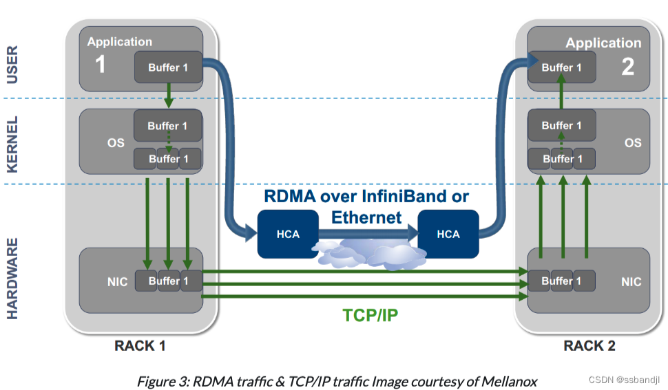

# RDMA(RemoteDirect Memory Access)
DMA 代表直接内存访问。这意味着应用程序可以在 CPU 干预的情况下直接访问（读/写）主机内存。如果您在主机之间执行此操作，它将成为远程直接内存访问 (RDMA)

## Why RDMA
与正常的 TCP/IP 行为相比，数据不必多次从应用程序内存缓冲区复制到内核内存缓冲区。RDMA通过其他复制操作传递到 NIC，NIC 通过网络将其发送到其他主机。

#### IB
InfiniBand是以太网和光纤通道的替代方案。IB 提供高带宽和低延迟。IB 可以直接在一台计算机上的存储设备与另一台计算机上的用户空间之间传输数据，从而绕过并避免系统调用的开销。IB 适配器可以处理网络协议，这与在 CPU 上运行的以太网网络协议不同。这使得操作系统和 CPU 在进行高带宽传输时保持空闲。
- 带宽  
信号传速率约50Gb/s
- 延迟  
延迟<0.5us 相比之下10Gb以太网约7us,差10倍多

## How to use RDMA
使用 RDMA 通常需要实现 InfiniBand、Omni-Path、RoCE 或 iWARP 协议的专用网络硬件。Soft-RoCE 通过标准以太网 NIC 提供 RDMA 功能。

内核中的上层协议（ULP）实现RDMA加速服务，例如IP（例如IPoIB）和存储（例如iSER、SRP）。应用程序不需要感知 RDMA 即可从这些内核提供的 RDMA 服务中受益。

应用软件可以通过使用RDMA API（例如libibverbs、libfabrics）或RDMA感知框架（例如openmpi）来感知RDMA。这些应用程序将从实施 RDMA 的网络中获益最多

[Intro](https://cloud.tencent.com/developer/article/2372479)  
[RDMA Resources](https://gist.github.com/aagontuk/705315c94eeaf657b3f35b011c233c19)
