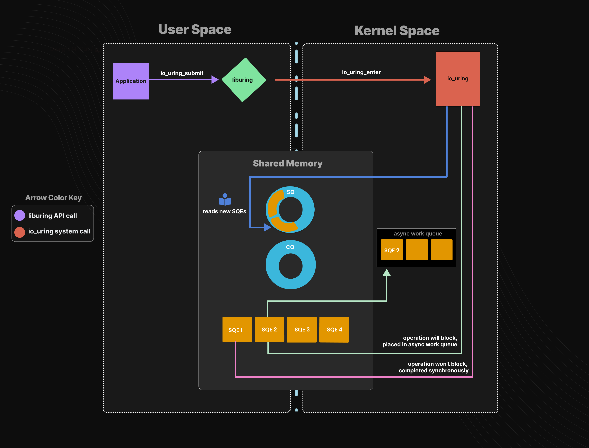

# <font color="3d8c95">io_uring</font>
## <font color="dc843f">Why io_uring</font>
io_uring 主要通过<font color="fed3a8">用户态与内核态共享内存</font>的途径，来摒弃使用系统调用来提交 I/O 操作和获取 I/O 操作的结果，从而<font color="fed3a8">避免了上下文切换</font>的情况。另外，由于用户态进程与内核态线程通过共享内存的方式通信，从而<font color="fed3a8">避免了内存拷贝的过程</font>，提升了 I/O 操作的性能。


## <font color="dc843f">How to use io_uring</font>
[liburing](https://github.com/axboe/liburing)

***系统调用***  
io_uring 只增加了三个 Linux 系统调用分别是 `io_uring_setup`，`io_uring_enter` 和 `io_uring_register` 
他们的入口都在 Linux 内核源码的 `fs/io_uring.c` 文件中  
用户程序可以直接利用 `syscall(__NR_xxx, ……)` 的方式直接调用，使用起来很麻烦  

***liburing***  
由于直接使用系统调用较为复杂，Jens Axboe 还提供了封装好的用户态库 liburing，简化了 io_uring 的使用，代码位置在 github 上

样例
liburing 仓库的 examples/ 目录下提供了几个简单的样例程序：
| 文件            | 功能                             | 其他                                                                 |
| --------------- | -------------------------------- | -------------------------------------------------------------------- |
| io_uring-test.c | 读取一个文件的全部内容           | -                                                                    |
| io_uring-cp.c   | 复制一个文件的内容到另一个文件   | 利用 user_data 手动处理读写 IO 之间的依赖，读 IO 返回之后才下发写 IO |
| link-cp.c       | 复制一个文件的内容到另一个文件   | 同时下发读写，利用 IOSQE_IO_LINK 保证读写之间的依赖[2]               |
| ucontext-cp.c   | 复制 n 个文件的内容到另 n 个文件 | 利用 ucontext 进行上下文切换，模拟协程                               |

***代码流程***  
仔细阅读前三个用例，可以看出利用 io_uring 的一般流程如下：
- 利用 `open`、`fstat` 等函数来打开文件以及元数据查看等操作  
因为 io_uring 替换的是读写接口，后续 io_uring 操作的对象是 fd（由 open 函数执行返回的）
- 利用 `io_uring_queue_init` 初始化 `struct io_uring ring` 结构体
- 初始化 `struct iovec *iovecs` 结构体用于存放用户态 buffer 指针和长度
- 通过 `io_uring_get_sqe` 获取 sqe
- 通过 `io_uring_prep_#OP` 对 sqe 填充命令，buffer 以及 offset 信息  
【可选】 通过 `io_uring_sqe_set_data` 对 sqe 附加 user_data 信息（该信息会在 cqe 中进行返回）
- 通过 `io_uring_submit` 对整个 ring 的所有 sqe 进行下发
- 通过 `io_uring_wait_cqe` 或者 `io_uring_peek_cqe` 来获取 cqe  
`io_uring_wait_cqe` 会阻塞当前线程直到有一个 cqe 返回  
`io_uring_peek_cqe` 不会阻塞，如果当前没有 cqe，就会返回错误  
`io_uring_cqe_get_data` 可以从 cqe 中获取 user_data  
通过 `io_uring_cqe_seen` 对当前 cqe 进行清除，避免被二次处理  
所有 IO 完成后，通过 `io_uring_queue_exit` 将 ring 销毁  

***编译***  
根据官方 `Makefile` 可以看出编译时有额外的三个条件

定义 _GNU_SOURCE 宏，-D 宏定义
指定额外的头文件目录，-I 指定头文件目录位置
使用 liburing 库，-L 指定库位置，-l 指定库名
即 `gcc -D_GNU_SOURCE -I../src/include/ -L../src/ -luring -o test test.c
`
其中头文件目录下主要有三个头文件：
```
$ tree src/include/
src/include/
├── liburing
│   ├── barrier.h
│   └── io_uring.h
└── liburing.h

1 directory, 3 files
```
而 liburing 库也需要编译生成，推荐直接在 liburing 的顶层目录直接 `make all`

## <font color="dc843f">io_uring 与 epoll 的使用对比</font>
epoll 通常的编程模型如下：
```
struct epoll_event ev; 
 
/* for accept(2) */ 
ev.events = EPOLLIN; 
ev.data.fd = sock_listen_fd; 
epoll_ctl(epollfd, EPOLL_CTL_ADD, sock_listen_fd, &ev); 
 
/* for recv(2) */ 
ev.events = EPOLLIN | EPOLLET; 
ev.data.fd = sock_conn_fd; 
epoll_ctl(epollfd, EPOLL_CTL_ADD, sock_conn_fd, &ev); 
```
然后在一个主循环中： 
```
new_events = epoll_wait(epollfd, events, MAX_EVENTS, -1); 
for (i = 0; i < new_events; ++i) { 
    /* process every events */ 
    ... 
} 
```
epoll本质上是实现类似如下事件驱动结构：
```
struct event { 
    int fd; 
    handler_t handler; 
}；
```
将fd通过epoll_ctl进行注册，当该fd上有事件ready, 在epoll_wait返回时可以获知完成的事件，然后依次调用每个事件的handler, 每个handler里调用recv(2), send(2)等进行消息收发。

io_uring的编程模型如下(这里用到了liburing提供的一些接口):
```
/* 用sqe对一次recv操作进行描述 */ 
struct io_uring_sqe *sqe = io_uring_get_sqe(ring); 
io_uring_prep_recv(sqe, fd, bufs[fd], size, 0); 
 
/* 提交该sqe, 也就是提交recv操作 */ 
io_uring_submit(&ring); 
 
/* 等待完成的事件 */ 
io_uring_submit_and_wait(&ring, 1); 
cqe_count = io_uring_peek_batch_cqe(&ring, cqes, sizeof(cqes) / sizeof(cqes[0]));    
for (i = 0; i < cqe_count; ++i) { 
    struct io_uring_cqe *cqe = cqes[i]; 
    /* 依次处理reap每一个io请求，然后可以调用请求对应的handler */ 
    ... 
} 
```
---
Reference

[图解io_uring](https://mp.weixin.qq.com/s/1wZpFhwJR-LNkQm-QzFxRQ)  
[实战debug](https://blog.csdn.net/u010180372/article/details/124369456)  
[全链路异步](https://www.cnblogs.com/crazymakercircle/p/17149644.html#)  