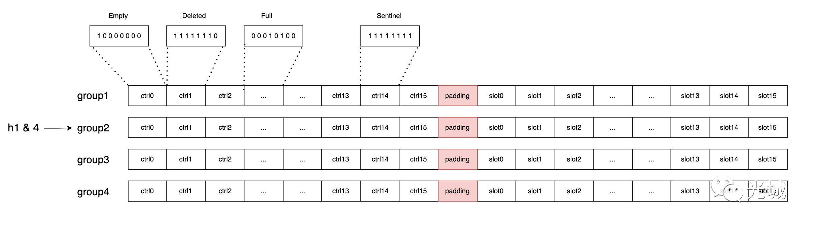
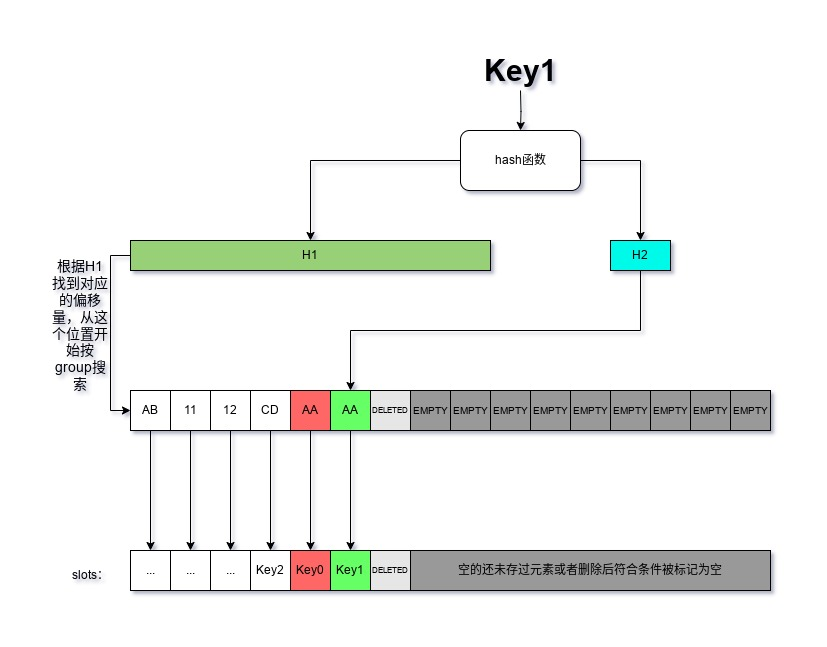
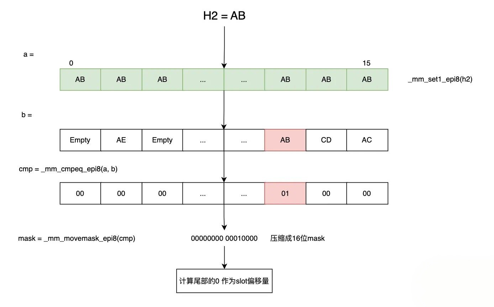

# Swisstable
## 前言：
需要用到SIMD sse2指令集, 见SIMD篇

keyword: 局部性原理，SSE2，哈希冲突，性能抖动

## 传统HashMap vs Swisstable
**传统HashMap**
1. 线性探测法（Linear Probing）
属于开放寻址法（Open Addressing）的一种。当发生哈希冲突时，也就是新插入的元素计算出的哈希地址已经被其他元素占用，线性探测法会从该冲突位置开始，按照顺序依次检查下一个位置（通常是逐个位置往后检查），直到找到一个空位置来存放新元素。
例如，假设哈希表大小为 10，哈希函数为 h(key) = key % 10，要插入键值 11 和 21。11 计算得到的哈希地址是 11 % 10 = 1，如果位置 1 已经被占用，就会检查位置 2，若位置 2 为空，就把 11 存放在位置 2；当插入 21 时，其哈希地址同样是 21 % 10 = 1，若位置 1 和 2 都被占用，就会继续往后检查位置 3 等，直到找到空位置。
2. 开链法（Chaining）
也称为链地址法。它为哈希表的每个槽（Bucket）都维护一个链表（或其他动态数据结构，如红黑树等，在元素数量较多时某些实现会从链表转换为红黑树以提高查找效率）。当不同的键通过哈希函数计算得到相同的哈希地址时，这些元素会被插入到该哈希地址对应的链表中。
比如同样哈希表大小为 10，哈希函数 h(key) = key % 10，插入键值 11 和 21，它们哈希地址都是 1，那么 11 和 21 会被依次插入到位置 1 对应的链表中。

**Swisstable**

常见的哈希表实现，它们要么浪费内存且对缓存不友好；要么发生冲突后会更容易导致查找、插入、删除操作性能下降。这还是在有“完美哈希函数”的情况下，如果你用了个不那么好的哈希函数，那会导致key冲突的概率大大上升，性能问题会更加明显，最坏的情况下性能甚至会不如在数组里进行线性搜索。  
swisstable力求在缓存友好、性能和内存用量上找到平衡.  
时间复杂度和线性探测法的差不多，空间复杂度介于链表法和线性探测之间。

## swisstable原理
使用改进的线性探测法来解决hash冲突。

swisstable比传统哈希表更快的秘诀就在于这些被叫做“control bytes”的slot控制信息里
控制信息主要是下面这几种：
- slot是否为空
- slot里的元素是否已经被删除
- slot里存的键值对的key的哈希特征（H2）

对于空、删除和边界这几种特殊状态，对应的值都是特意设置的，为了在SIMD指令操作时获得最高的性能。

查找、插入、删除都是基于这些control bytes的，它们非常小，可以尽量多的被放入CPU的高速缓存，同时又包含了足够的信息以满足哈希表的增删改查。而slot就只用来存数据，control bytes和slot一一对应，控制信息在control bytes里的索引就是对应的数据在slot里的索引。  

另外还可以看到图里还有一个group的结构，这个结构没有实体存在（虽然在abseil的实现里有对应的类存在），它由连续的N个控制信息组成，swisstable的线性探测是以group为基础单位的，一次探测一个group，没有找到目标就会移动到下一个group继续查找。
至于它为什么这么快，有一个比较次要的原因我们已经知道了：所有的操作基本都在control bytes上进行，一个控制信息只有8bit，而且控制信息们紧密排列在连续的内存里对缓存更友好，所以哈希表操作时的缓存命中率会更高，客观上会提高一点性能。

**SwissTable的查找**

提高CPU缓存命中率可以极大提升性能，但不会达到很多性能测试里展示的那种云泥之别。所以swisstable的快主要体现在别的地方——更巧妙的查找算法。
swisstable会根据H1的值来确定group的起始位置，然后按照一个个group去做“线性探测”。
假设我们有一个key叫Key1，它已经存在了swisstable里，这时候swisstable里的局部数据是下面那样的：

我们要找的数据正好在这个group里，但还有另一个key的哈希特征和我们要找的目标冲突了。按照正常的线性探测法的流程，我们应该根据这个group里的控制信息的索引，找到对应的slot，然后把里面的key拿出来一一做相等比较，直到找到我们要的目标，在这里我们需要相等比较六次。

**核心：利用SIMD一次比较一整个group**

事实上swisstable会先一次比较一整个group里的哈希特征信息，先把特征值不相等的元素全部排除，特征值不相等那说明key肯定不会相等。
这样一次检查了16个值，在这个例子里我们过滤出了两个需要检查的索引值，相等比较的次数一次减少了三分之二。上面这样的比较借助现代CPU的SIMD功能，只需要三到四条指令即可完成。
将哈希特征比较结果转换成uint32的整数也是很巧妙的一步。不转化的话我们仍然需要遍历去寻找有效的数据的索引，然而转换成数字之后我们只需要去计算这个数字的二进制数据里有多少个尾随的0即可，这在大部分平台上都只需要一条指令就能完成；想要查找下一个有效的所以，只需要一个小小的位运算技巧就可以把上次找到的为1的位转换成0，然后再次计算尾随0的数量即可。整体会比遍历快很多倍。
如果当前的group里没找到，那么就会移动到下一个group，重复上面的步骤，直到找到数据或者遇到了control bytes的结束标志。
这个例子里我们在第一个group里就找到了，而且运气很好只需要一次相等比较（这里计算尾随0的话会导致从后往前检查找到的索引，我们要找的Key1正巧在最后面），而普通的线性探测需要相等比较6次。
这就是swisstable拥有惊人性能的主要原因：它尽量避免线性探测法导致的大量等值比较和链表法会带来的缓存命中率低下，以及在单位时间内它能同时过滤N个（通常为16，因为16x8=128，是大多数平台上SIMD指令专用的向量寄存器的大小）元素，且可以用位运算代替对数据的遍历。这会为哈希表的吞吐量带来质的飞跃。

## SwissTable还有什么需要注意的地方
对于使用者来说只有一个需要注意的地方：如果你要自定义key的哈希函数，一定得提供一个质量最上乘的。因为现在哈希函数计算出来的值除了要让数据尽量均匀分布之外，还得尽量保证每一个bit的概率均等性，也就是尽量接近前面说的“`完美哈希函数`”，否则哈希特征值会出现很多重复值，这样即使有再多的批量操作，还是会被大量等值比较拖慢速度。不过这也有上限，最低也差不多在1/128，因为我们就用了七位哈希值。如果我们用了个质量堪忧的哈希函数，这个重复率就可能变成1/20，SIMD带来的性能优势可能就荡然无存了。

对于想实现swisstable的人来说，注意点会稍微多一些。
1. 注意内存对齐，SSE2要求操作的内存地址是对齐过的，如果不是它会自己转换，这个转换非常耗时。所以abseil的实现上不仅分配的时候处理对齐，还用填充数据保证了这一点。
2. slot的个数，选择了不合适的slot数量会导致H1定位冲突的增加，因此像abseil选择了2**N-1作为slot的数量，扩容也是按照N∈{1, 2, 3, 4, ...}这样的方式扩容的。
3. 用作存放控制信息的数据类型大小最好是8bit，多了浪费少了不能充分表示信息并加大了冲突概率，而且这8bit必须是全部可以使用的；如果用的是c/c++，那么char不能用，因为char是否带符号是平台和编译器定义的，没有可移植性，不用unsigned char是因为标准只规定了它的最小大小，没规定上限，所以不如intN_t这样的类型来的保险。可以学abseil用int8_t。